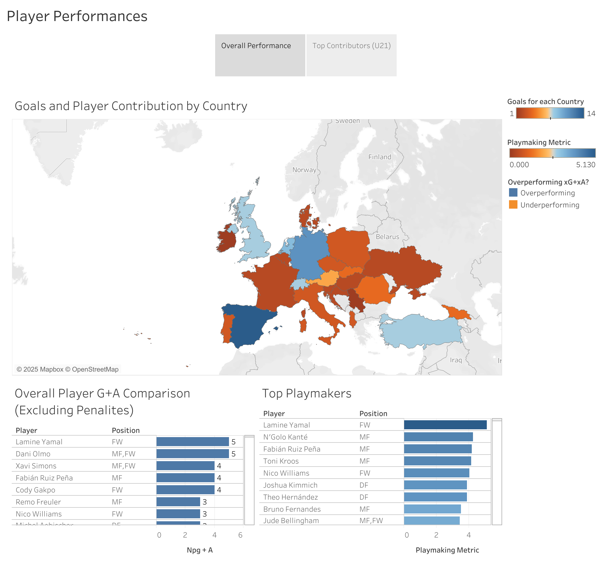
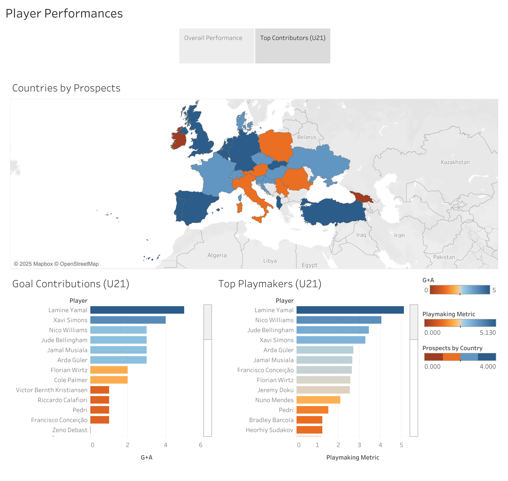

# 📊 [Euro 2024 Statistical Analysis] – Interactive Tableau Dashboard

An interactive data visualization project exploring **[The 2024 Euros]**.  
This project was built in Tableau to uncover trends, highlight key insights, and present findings in a clear, interactive format.

---

## 🌐 Dashboard Access
🔗 [View on Tableau Public](https://public.tableau.com/views/Euro2024PlayerData/Story1?:language=en-US&:sid=&:redirect=auth&:display_count=n&:origin=viz_share_link)

---

## 📂 Dataset
- **Source:** [https://www.kaggle.com/datasets/mexwell/uefa-euro-2024-database]  
- **Size/Scope:** [623 player records · 10 columns (attributes)]  
- **Key Features:**
  Player info: Name, Position, Age, Country, Club
  Physical attributes: Height, Preferred Foot
  Player Statistics: Player Defense Actions, Player Goal and Shot Creation, Player Passing, Player Shooting, etc.

---

## 🔑 Key Insights
- Insight 1 – Lamine Yamal was most productive player, while being the most active playmaker, regardless of age group.  
- Insight 2 – No team played more than four u21 players in the tournement, while only two countries played zero u21 players.    
- Insight 3 – Only twelve u21 players got a goal contribution, with only six of them having greater than two goal contributions.

---

## 🛠️ Tools Used
- **Tableau** – built interactive dashboards, created calculated fields (e.g., Playmaking Metric, Prospects, Performance), applied filters, and used color-coding for player performance.
- **Excel / CSV** - Cleaned and prepped the data by cross referencing with offical stats.  

---

## 📸 Dashboard Preview

---

## 📜 Citation
> Mexwell. (2024). UEFA EURO 2024 Database [Dataset]. Kaggle. https://www.kaggle.com/datasets/mexwell/uefa-euro-2024-database

---

**Author:** Ryan Shahidi  
📧 ryanshahidi04@gmail.com · 🔗 [LinkedIn](www.linkedin.com/in/ryan-shahidi-39b705253) · 🔗 [GitHub](https://github.com/rshahidi7)
